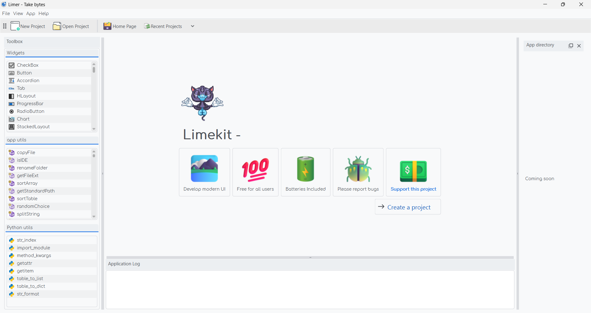

=================
Installation
=================

.. highlight:: console

.. contents:: Content
    :depth: 1
    :local:
    :backlinks: top

What's Limekit?
=================

*Limekit* is framework for building desktop applications using the `lua <https://www.lua.org/>`_ language without the need for HTML and CSS. On the other hand allowing developers to maintain one lua codebase and create cross-platform apps that work on ``Windows``, ``macOS``, and ``Linux``.

~ It is being developed by company called :mod:`Take bytes`, with :mod:`Omega Msiska` as the lead developer on this project.

Key Features:

- **Modern UI**: Limekit allows developers to craft beautiful UI's with dark and light modes available.
- **Simplicity**: One of the notable features of Limekit is it's ability to create a working program in under 2 lines of code as shown below.

    .. code-block:: lua
        :linenos:

        local window = Window{title='Limekit app', icon=images('app.png')}
        window:show()

    - This is basically enough for Limekit to run your program. Mind blowing right? 😊

Guess what?
------------
    
- **No C, C++ or python knowledge**: You don't need to know any python, C or C++ to develop programs in :mod:`Limekit`, just lua
- **Cross-platform**: Run the same code base in Windows, Linux and macOS
- **Free**: The framework is free to use

Installing Python
======================

The Limekit framework is built in Python 3.10, so :command:`you'll need to have Python 3.10 installed` to use the framework. Follow the tutorial to get Python 3.10 installed on your OS.

.. note::
    This guide is for those who haven't delved into Python before and are installing it for the very first time.

Windows
----------

- Installing python on Windows is pretty straight forward. Simply visit `python's website <https://www.python.org/downloads/release/python-31011/>`_ to download for your system

Once the installation is complete, open your terminal (Comamnd Prompt or PowerShell) and type the following command::

    $ python

If you get a similar output as the one below, you are good to go! 😊

.. code-block::
    
    Python 3.10.6 (tags/v3.10.6:9c7b4bd, Aug  1 2022, 21:53:49) [MSC v.1932 64 bit (AMD64)] on win32
    Type "help", "copyright", "credits" or "license" for more information.
    >>>

Navigate to the bottom of the page to follow through the final stages

Linux
----------

.. note::

    The framework has only been tested on Ubuntu, but it's expected to function on other Linux distros as well.

Done installing. What's next?
===============================

Head over to `our github repo <https://www.python.org/downloads/release/python-31011/>`_ to download :mod:`Limer`.

.. important::

    :mod:`Limer` is the program that ``only`` executes your apps. It is not an IDE nor an editor.

Inside the downloaded archieve, there are files with ``.bat`` and ``.sh`` extensions. If on Windows, use :mod:`.bat` files, and if on Linux and macOS use :mod:`.sh` files. You can delete the other files you wont be needing.

Alright, with that sorted out, let's go through these 2 important steps

1. The first step is to download the Limekit framework in your system. Execute the :mod:`download` file to launch the process.

   This process requires an active internet connection.

2. After successfuly installing Limekit in your system. Execute the :mod:`run` to launch the 

If all goes well, you'll be welcomed by a similar screen shown below

