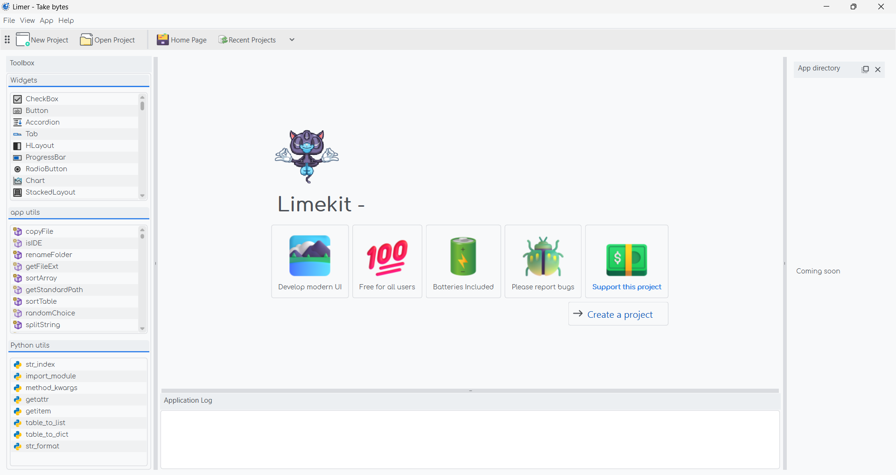

=================
Installation
=================

.. highlight:: console

.. contents:: Content
    :depth: 1
    :local:
    :backlinks: top

What's Limekit?
=================

*Limekit* is a framework for building desktop applications using the `lua <https://www.lua.org/>`_ language without the need for HTML and CSS, allowing developers to maintain one lua codebase and create cross-platform apps that work on ``Windows``, ``macOS``, and ``Linux``.

~ It is being developed by a company called :mod:`Take bytes`, with :mod:`Omega Msiska` as the lead developer on this project.

Key Features:

- **Modern UI**: Limekit allows developers to craft beautiful UI's with dark and light modes available.
- **Simplicity**: One of the notable features of Limekit is its ability to create a working program in three lines of code.

    .. code-block:: lua
        :linenos:

        local ui = require("limekit.ui")
        local window = ui.Window { title = "Limekit app" }
        window:show()

    - This is basically enough for Limekit to run your program. Mind blowing right? 😊

Guess what?
------------

- **No C, C++ or python knowledge**: You don't need to know any python, C or C++ to develop programs in :mod:`Limekit`, just lua
- **Cross-platform**: Run the same code base in Windows, Linux and macOS
- **Free**: The framework is free to use

Installing Python
======================

The Limekit framework is built in Python, so :command:`you'll need Python 3.10 or newer` to use it. Follow the tutorial to get Python installed on your OS.

.. note::
    This guide is for those who haven't delved into Python before and are installing it for the very first time.

Windows
----------

- Installing python on Windows is pretty straight forward. Simply visit `python's website <https://www.python.org/downloads/>`_ to download for your system

Once the installation is complete, open your terminal (Command Prompt or PowerShell) and type the following command::

    $ python

If you get a similar output as the one below, you are good to go! 😊

.. code-block::

    Python 3.13.0 (tags/v3.13.0:60403a5, Oct  7 2024, 09:38:07) [MSC v.1941 64 bit (AMD64)] on win32
    Type "help", "copyright", "credits" or "license" for more information.
    >>>

Navigate to the bottom of the page to follow through the final stages

Linux
----------

.. note::

    The framework has only been tested on Ubuntu, but it's expected to function on other Linux distros as well.

.. important::

    Before trying to install python, try executing ``python3 --version`` in the terminal to see if python is already installed, as most Linux distributions come with python installed

Most current distributions ship a suitable Python. If yours does not, your package manager will have one -- on Ubuntu, ``sudo apt install python3 python3-pip``.

Done installing. What's next?
===============================

.. important::

    Read the below instructions before downloading anything

    All required files should be downloaded from the :mod:`Releases` page (right hand side) in the github links provided

    :mod:`Installation requires an active internet connection`

Head over to `our github repo <https://github.com/mitosisX/Limer-Limekit/>`_ to download :mod:`Limer`.

There are :mod:`plenty of examples` prepared for your journey in Limekit, just click `here <https://github.com/mitosisX/limekit-demos/>`_ to download them. The ``2.0-examples`` folder holds the ones written against this version of the framework.

.. note::

    :mod:`Limer` is the program that ``only`` runs your apps. It's not an IDE or an editor.

Download all the zip files from the :mod:`Releases` section and extract them. Inside the windows-only.zip or linuxmac-only.zip there should be a ``READ ME.txt`` file that explains everything.

If everything goes as planned, you'll be greeted by a screen similar to the one shown below.

Your first project
=====================

A Limekit project is just a folder with a particular shape:

.. code-block::

   my-app/
     app.json
     scripts/
       main.lua
     images/
     misc/

Create ``app.json`` and mark the project as 2.0:

.. code-block:: json

   {
     "project": {
       "name": "My app",
       "author": "You",
       "version": "1.0",
       "api": "2.0"
     }
   }

Then put this in ``scripts/main.lua``:

.. code-block:: lua
   :linenos:

   local ui = require("limekit.ui")

   local window = ui.Window { title = "My app", size = { 400, 220 } }

   local label = ui.Label("Nothing clicked yet")
   label:setTextAlignment("center")

   local button = ui.Button("Click me")
   button:setOnClick(function()
       label:setText("You clicked the button")
   end)

   local layout = ui.VLayout()
   layout:setSpacing(10)
   layout:setMargins(20, 20, 20, 20)
   layout:addChild(label)
   layout:addChild(button)

   window:setLayout(layout)
   window:show()

Open the folder in Limer and press Run. You can also run it straight from a terminal::

    $ python -m limekit path/to/my-app

.. important::

   The ``"api": "2.0"`` line matters. Without it, Limekit falls back to looking
   for a ``require("limekit.…")`` call in your ``main.lua`` to decide which
   engine to use. Declaring it explicitly is clearer and never guesses wrong.

You can now move on to :doc:`Core concepts <concepts>`, which covers the few
rules that apply to every widget in the framework.
