Limekit
=============

:Version: |release|
:Contact: omegamsiskah@gmail.com
:Author: Omega Msiska

Let's get you started!
==================================

*Limekit* is a framework (wrapper for PySide6) for building desktop applications using the `lua <https://www.lua.org/>`_ language without the need for HTML and CSS. The framework allows developers to maintain a single lua codebase and create cross-platform apps that work on Windows, macOS, and Linux.

.. note::

   The framework is created in `Python <https://www.python.org/>`_, but there's no need for you to learn Python at all.

.. important::

   This documentation covers **Limekit 2.0**, which introduces a module system, a
   uniform error guard, and consistent 1-based indexing.

   If you have an app written for Limekit 1.x, it keeps running unchanged --
   Limer detects the version of every project and launches it on the matching
   engine. When you are ready to move it across, see
   :doc:`Migrating from 1.x <migrating>`.

Your first app, in full:

.. code-block:: lua
   :linenos:

   local ui = require("limekit.ui")

   local window = ui.Window { title = "Hello, Limekit", size = { 320, 160 } }

   local button = ui.Button("Click me")
   button:setOnClick(function()
       button:setText("Clicked!")
   end)

   local layout = ui.VLayout()
   layout:addChild(button)

   window:setLayout(layout)
   window:show()

What is new in 2.0
=====================

* **Modules instead of globals.** Nothing is injected into the global namespace.
  You ask for what you need with ``require("limekit.ui")``, and your editor can
  autocomplete every class because the framework ships Lua Language Server stubs.

* **Errors no longer kill your app.** Every handler you attach crosses a guard.
  A mistake in one button's callback is reported with the widget and event name
  attached, and the rest of the app carries on running.

* **Everything counts from 1.** Rows, columns, tabs, and list items are all
  1-based, matching Lua itself. In 1.x some widgets counted from 0 and others
  from 1.

* **Setters chain.** Every setter returns the widget, so
  ``label:setText("Hi"):setWordWrap(true)`` works.

* **Friendlier values.** Where 1.x wanted a constant, 2.0 takes a plain string:
  ``slider:setOrientation("vertical")``. Pass an unknown one and you get an error
  naming the valid options instead of silence.

Where to go next
==================================

* :doc:`Part 1: Setup <getting-started>`: Guides you step-by-step to set up Python on your computer, which is crucial as the framework depends on the Python language.

* :doc:`Part 2: Core concepts <concepts>`: The handful of rules that apply everywhere -- modules, chaining, indexing, and what happens when your code raises an error. Read this one before the reference pages.

* :doc:`Part 3: Widgets </widgets>`: Focuses on interactivity. Think buttons, combo boxes, menus, check boxes, radio buttons and many more - they're all in the mix!

* :doc:`Part 4: Widget Items </widget-items>`: Covers how to interact with some special widgets such as the Tab, ToolBar, etc.

* :doc:`Part 5: Layout Managers </layouts>`: Covers the different layouts available in the framework

* :doc:`Part 6: Services </services>`: The filesystem, the running machine, dialogs, themes, and your project's own images and scripts.

* :doc:`Part 7: Charts </charts>`: Line, bar and area charts, with axes and legends.

* :doc:`Part 8: Batteries included <batteries>`: Covers all the other features provided by the framework, such as the sqlite3 database, using the system tray, displaying system notifications, threads, signals, and timers.

* :doc:`Part 9: Migrating from 1.x <migrating>`: A table of every rename, every corrected method, and the handful of behaviours that deliberately changed.

Showcase
===========

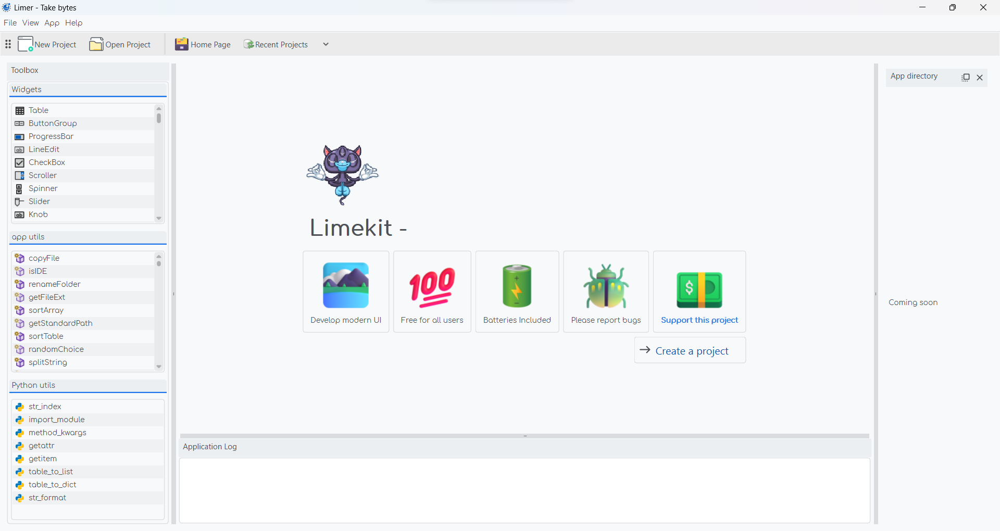

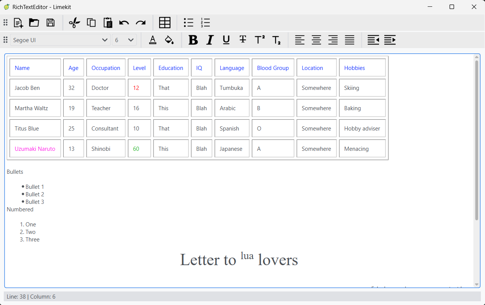

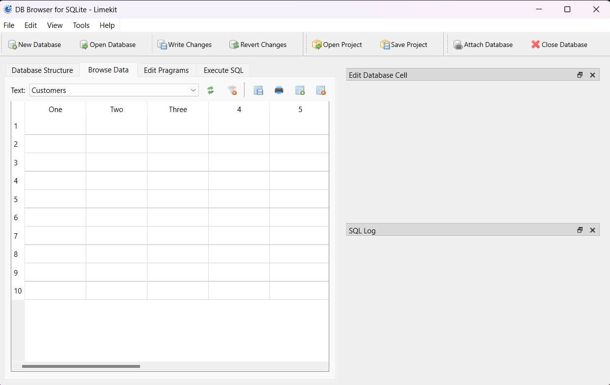

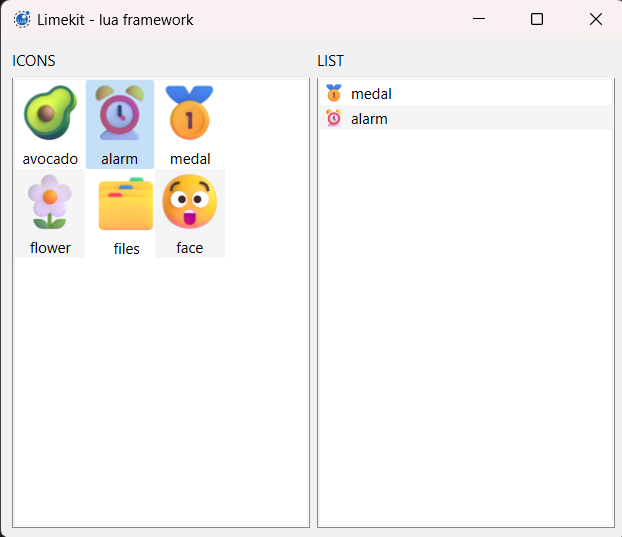

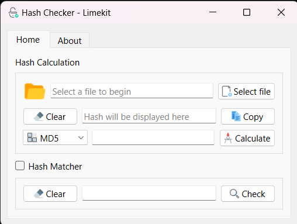

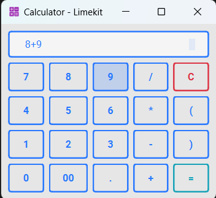

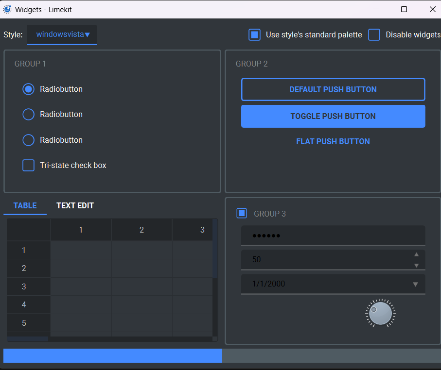

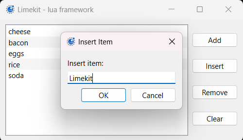

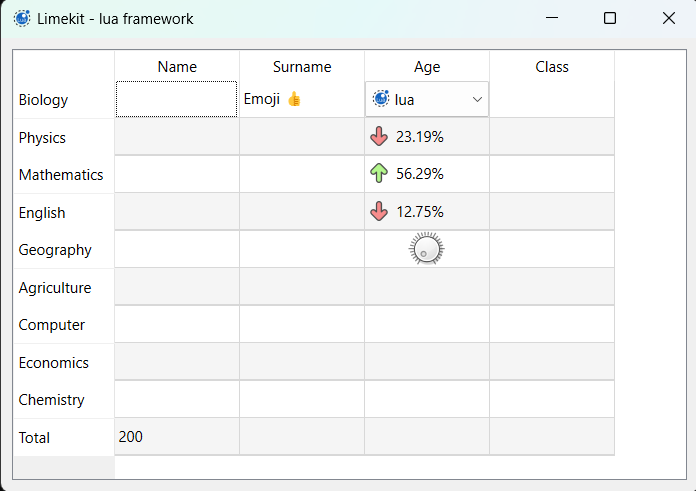

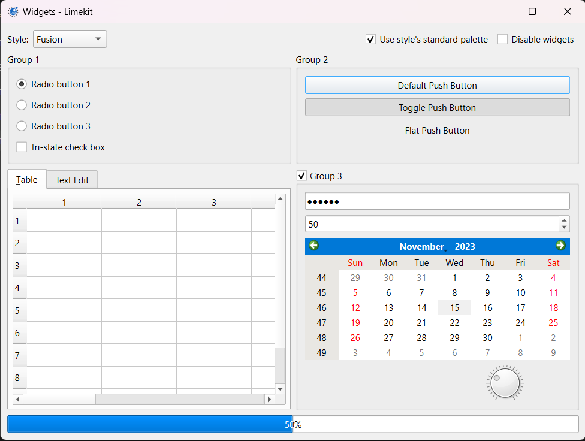

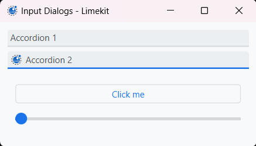

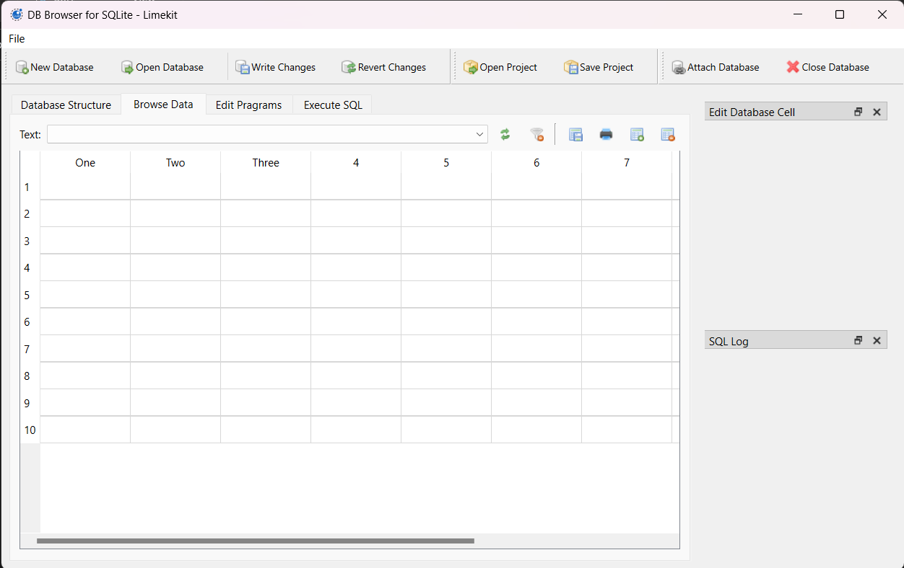

Getting help
=============

Having trouble?

Head over to our `discord server <https://www.reddit.com/r/limekit>`_
Try asking in our `r/limekit <https://www.reddit.com/r/limekit>`_ reddit community

Or contact me on omegamsiskah@gmail.com

Support the project
=====================

Buy me a coffee to support the project. This will help me stay awake at night 😁

visit `buymeacoffee.com/omegamsiska <https://www.buymeacoffee.com/omegamsiska>`_

.. :hidden: directive is there to hide the toctree
.. toctree::
   :name: mastertoc
   :hidden:

   getting-started
   concepts
   widgets
   widget-items
   layouts
   services
   charts
   batteries
   migrating
   questions
