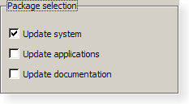

GroupBox
###########

A titled frame around a set of related widgets. It makes a form easier to scan
and, when the widgets inside are :doc:`radio buttons </widgets/radio-button>`,
it also makes them a single set of choices.

.. code-block:: lua
  :linenos:

  local ui = require("limekit.ui")

  local box = ui.GroupBox("Paper size")

  local inner = ui.VLayout()
  inner:addChild(ui.RadioButton("A4"))
  inner:addChild(ui.RadioButton("Letter"))
  inner:addChild(ui.RadioButton("Legal"))

  box:setLayout(inner)

Properties
***************

.. function:: setTitle(text) / getTitle()
  :no-index:

  The heading on the frame.

.. function:: setLayout(layout) / getLayout()
  :no-index:

  The layout held inside.

.. function:: setCheckable(checkable) / isCheckable()
  :no-index:

  Puts a checkbox in the title. Unticking it disables everything inside, which
  is a tidy way to switch off a whole section of a form.

  .. code-block:: lua

     local advanced = ui.GroupBox("Advanced options")
     advanced:setCheckable(true)
     advanced:setChecked(false)

.. function:: setChecked(checked) / isChecked()
  :no-index:

  The state of that checkbox.

.. function:: setFlat(flat) / isFlat()
  :no-index:

  Draws the title with only a line beneath it instead of a full frame.
